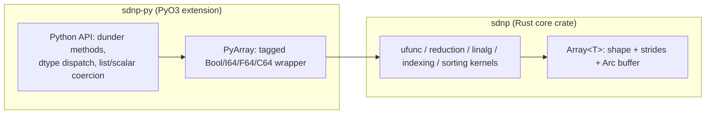

# stardust-numpy (`sdnp`)

`sdnp` is a from-scratch, NumPy-style N-dimensional array library written in
Rust, with a Python extension module (`sdnp-py/`) built on **PyO3**.

The project exists to **learn NumPy by rebuilding its core from first
principles** — no `ndarray` crate, no shortcuts on the tricky parts (strides,
broadcasting, fancy indexing, reductions, CoW views). At the same time, it is
not a toy: every hot path is written to be genuinely fast, and the benchmark
suite exists to keep it honest against real NumPy when you run it locally.

- **Educational**: `Array<T>` is implemented directly on flat buffers with
  explicit shape/stride bookkeeping, so every operation (broadcasting, views,
  gather/scatter, reductions, linear algebra) is traceable end to end.
- **Optimization-aware**: contiguous fast paths, coalesced stride runs, `Arc`
  copy-on-write buffers, and release-profile LTO builds are treated as
  first-class concerns, not an afterthought.
- **Measured on demand**: [`BENCHMARK.md`](BENCHMARK.md) is generated locally
  from the sdnp-vs-NumPy benchmark matrix (`benches/benchmark.py run`).

Behavioral reference: a sibling Python project (`../numpy`), with a documented
set of intentional differences (see [Differences from NumPy](#differences-from-numpy)).

## Contents

- [Architecture](#architecture)
- [Repository layout](#repository-layout)
- [Getting started](#getting-started)
- [Quick example](#quick-example)
- [Feature overview](#feature-overview)
- [Differences from NumPy](#differences-from-numpy)
- [Testing](#testing)
- [Benchmarking](#benchmarking)
- [CI](#ci)
- [License](#license)

## Architecture



| Layer                               | Responsibility                                                                                                                                              |
| ----------------------------------- | ----------------------------------------------------------------------------------------------------------------------------------------------------------- |
| **Rust core** (`src/`)              | Buffers, shape/strides, views + copy-on-write, broadcasting, ufunc kernels, reductions, linear algebra, fancy indexing gather/scatter                       |
| **Python binding** (`sdnp-py/src/`) | `import sdnp`, operator overloading, Python object ↔ array coercion, runtime dtype dispatch over a compile-time-generic core, `__repr__`, error translation |

The Rust core stays fully generic over `T: Scalar` and has **no runtime dtype
concept**; `sdnp-py` wraps it in a small tagged enum (`Bool` / `I64` / `F64` /
`C64`) and matches on it once per call, so the compiled kernels stay
monomorphic and inlinable.

## Repository layout

```
stardust-numpy/
├── Cargo.toml            # workspace: root crate ("sdnp") + sdnp-py
├── src/                  # Rust core (crate: sdnp)
│   ├── dtype/            # Scalar + Promote + CastTo + ArrayCast + AsBool
│   ├── shape.rs          # size / strides / contiguity / offset_at
│   ├── axis.rs           # shared negative-axis normalization
│   ├── array/            # Array<T>, element get/set (CoW), transpose/reshape/squeeze
│   ├── broadcast.rs      # broadcast_shape / broadcast_to
│   ├── index/            # IndexSpec, bounds helpers, gather / scatter
│   ├── creation/         # factories, ranges/spaces, grids, triangular arrays
│   ├── ufunc/            # kernels + ops + traits
│   ├── traversal/        # coalesced layouts, RunPlan, stride cursors
│   ├── iteration/        # ndindex / ndenumerate / nditer / flat / axis-0
│   ├── reduction/        # plans, traits, ops, split kernel families
│   ├── manipulation/     # concatenate / stack / vstack / hstack
│   ├── selection/        # where_ / nonzero / clip
│   ├── sorting/          # sort / argsort / unique
│   └── linalg/           # contraction/diagonal geometry, kernels, public ops
├── tests/                # Rust integration tests (core-only semantics)
├── sdnp-py/              # PyO3 Python extension
│   ├── src/              # PyArray, dtype dispatch, binding-level validation
│   ├── tests/            # pytest: API contract, NumPy differential, property tests
│   └── pyproject.toml
├── benches/              # sdnp-vs-NumPy benchmark runner (see Benchmarking)
├── BENCHMARK.md          # generated report (local benchmark runs)
└── .github/workflows/    # CI: fmt/clippy/tests
```

## Getting started

Requires a stable Rust toolchain and Python ≥ 3.12.

```bash
# Rust core: format, lint, and test
cargo fmt --check
cargo check --workspace --all-targets
cargo clippy --workspace --all-targets -- -D warnings
cargo test --release --workspace

# Python extension
cd sdnp-py
python -m venv .venv
.venv/bin/pip install maturin pytest numpy hypothesis
.venv/bin/maturin develop --release
.venv/bin/pytest
```

On Python 3.14+, set `PYO3_USE_ABI3_FORWARD_COMPATIBILITY=1` when building if
PyO3 has not yet published wheels for your interpreter.

`cargo test` and benchmarking both require the `release` profile: the
`[profile.test]` section in `Cargo.toml` mirrors `[profile.release]` (LTO,
`opt-level = 3`, `codegen-units = 1`) so correctness tests run against the same
codegen as production, and the Python extension exposes
`sdnp.sdnp.__optimized__` / `__build_profile__` so tooling can refuse to
benchmark a debug build.

## Quick example

```python
import sdnp

a = sdnp.arange(6).reshape([2, 3])
b = sdnp.ones((2, 3))

c = sdnp.add(a, b)
assert c.shape == [2, 3]

total = sdnp.sum(a)
assert not isinstance(total, sdnp.Array)  # 0-D results unwrap to Python scalars

row = a[1]              # basic indexing -> zero-copy view
mask = sdnp.greater(a, 2)
picked = a[mask]        # boolean fancy indexing -> copy
```

## Feature overview

- **Array core**: `Array<T>` with `get`/`set` (copy-on-write), `transpose` /
  `t` / `permute_axes` / `reshape` / `squeeze` / `copy` / `astype`,
  `as_c_contiguous_slice`.
- **Creation**: `zeros` / `ones` / `full` / `arange` / `eye` / `eye_with`,
  `linspace` / `logspace` / `geomspace` / `meshgrid`,
  `tri` / `tri_with` / `tril` / `triu` / `diag`.
- **Broadcasting**: NumPy-compatible `broadcast_shape` / `broadcast_to`;
  broadcast views are read-only.
- **ufuncs**: arithmetic (`add`, `subtract`, `multiply`, `divide`,
  `trunc_divide`, `remainder`, `power`, `negative`, `absolute`), comparisons,
  `logical_and` / `or` / `not`, `isnan` / `isinf` / `isfinite`, complex
  `conj` / `real` / `imag` — all with automatic dtype promotion.
- **Reductions**: `sum` / `prod` / `min` / `max` / `mean` / `var` / `std` /
  `any` / `all` (with `axes`, `keepdims`); `argmin` / `argmax` / `cumsum` /
  `cumprod` (with `axis`); numeric reductions accept a `NanPolicy`
  (`propagate` / `ignore`).
- **Indexing**: `IndexSpec`-based `gather` / `scatter` / `scatter_array` —
  basic indexing (negative indices, steps, `newaxis`, ellipsis) returns
  zero-copy views; fancy/boolean indexing returns copies, matching NumPy's
  output shapes.
- **Manipulation**: `concatenate` / `stack` / `vstack` / `hstack`.
- **Selection**: `where_` / `nonzero` / `clip`.
- **Sorting**: `sort` / `argsort` / `unique`.
- **Linear algebra**: `dot` / `matmul` / `vdot` / `outer` / `diagonal` /
  `trace`.
- **Iteration**: `ndindex` / `ndenumerate` / `nditer`, plus `Array::flat` and
  axis-0 iteration.

On the Python side (`sdnp-py`), the exported `sdnp.__all__` surface wraps this
core with operator overloading, list/scalar coercion, 0-D unwrapping at the
Python boundary, and structured error translation (`sdnp::Error` → `PyErr`).

## Differences from NumPy

These are **intentional** design choices, not bugs — each is covered by its
own contract tests rather than hidden behind `xfail`.

| Aspect                         | Reference NumPy                                 | `sdnp`                                                                                                       |
| ------------------------------ | ----------------------------------------------- | ------------------------------------------------------------------------------------------------------------ |
| 0-D arrays                     | Rejected by the Python reference implementation | Allowed internally (`shape == []`, size 1); always unwrapped to a scalar before crossing the Python boundary |
| dtype                          | Runtime, open-ended (`str`, object, mixed)      | Four fixed types: `bool`, `i64`, `f64`, `Complex<f64>`; promotion is `bool < i64 < f64 < Complex<f64>`       |
| Storage                        | `list` or shared-write `ndarray` buffers        | `Arc<Vec<T>>`; views share the buffer, writes trigger copy-on-write (no write-through aliasing)              |
| Mixed-dtype ops                | Runtime promotion                               | `Promote` + `CastTo` traits resolved at the Rust type level                                                  |
| `/`                            | True division, always float                     | Follows Rust's `/`; integer floor division is the separate `trunc_divide`                                    |
| Operators                      | `a + b` via dunder methods                      | Rust core exposes free functions (`add(&a, &b)?`); `sdnp-py` adds the dunder wrapping                        |
| `out=` / `where=` ufunc kwargs | Supported                                       | Not supported                                                                                                |
| Zero-copy NumPy interop        | Writable shared buffers                         | Not exposed; array data crosses the boundary by copy or as read-only                                         |

## Testing

- **Rust (`tests/`)**: integration tests for core-only semantics that are not
  reachable through the Python boundary — 0-D internal representation, bool
  core arithmetic, structured errors, shape/stride overflow handling,
  copy-on-write, and non-contiguous gather/scatter/reduction/linalg paths.
- **Python (`sdnp-py/tests/`)**: the behavioral spec for the public API —
  contract tests (`__all__` completeness, signatures), per-domain tests
  (creation, ufuncs, reductions, indexing, linear algebra, manipulation,
  selection/sorting, iteration/repr), regression tests, and Hypothesis-based
  property tests that differentially check `sdnp` against NumPy across
  dtype/shape/view combinations.
- Tests never live alongside source files; each language keeps its own
  independent `tests/` tree.

```bash
cargo test --release --workspace          # Rust
cd sdnp-py && .venv/bin/pytest             # Python
```

## Benchmarking

`benches/` runs a single Python process that imports both the exported
`sdnp` API and NumPy, and measures them under identical conditions.

```bash
cd sdnp-py && .venv/bin/maturin develop --release && cd ..

# Discover functions and generated matrix cases
sdnp-py/.venv/bin/python benches/benchmark.py list --functions
sdnp-py/.venv/bin/python benches/benchmark.py list --profile smoke

# Standard suite, or every valid size x ndim x dtype combination
sdnp-py/.venv/bin/python benches/benchmark.py run
sdnp-py/.venv/bin/python benches/benchmark.py run --profile full

# One function, optionally intersected with matrix filters
sdnp-py/.venv/bin/python benches/benchmark.py run --function add
sdnp-py/.venv/bin/python benches/benchmark.py run \
  --function matmul --dtype float64 --size large

# Explicit measurement controls
sdnp-py/.venv/bin/python benches/benchmark.py run \
  --function sum --warmups 5 --samples 25 --iterations 10

# Rebuild Markdown and Canvas from an existing summary JSON
sdnp-py/.venv/bin/python benches/benchmark.py render
```

- Cases are generated from a `size x ndim x dtype` matrix (small/medium/large
  x 1/2/3/6-D x `bool`/`int64`/`float64`/`complex128`) intersected with
  per-function filters.
- Every run prints per-case progress to stdout and writes results
  incrementally, so a long run can be inspected while it's in progress.
- Raw samples go to `benches/results/benchmark.csv`; p25/p50/p75/mean
  statistics go to `benches/results/benchmark.json`; both are then rendered
  **mechanically** (no inferred commentary) into root [`BENCHMARK.md`](BENCHMARK.md)
  and a Cursor Canvas.
- The runner refuses to execute against a debug build — it checks
  `sdnp.sdnp.__optimized__` before measuring anything.

## CI

`.github/workflows/ci.yml` runs on every push and pull request:

1. **Rust job**: `cargo fmt --check`, `cargo clippy -- -D warnings`,
   `cargo test --release --workspace`.
2. **Python job**: release-build the extension and run the full pytest suite.

Benchmarks are run locally only; CI does not execute the benchmark matrix or
commit `BENCHMARK.md`.

## License

MIT — see [LICENSE](LICENSE).
