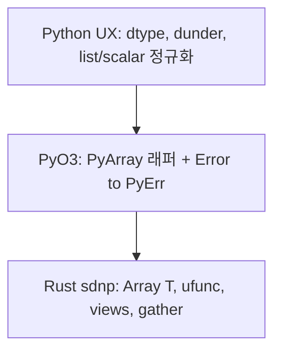
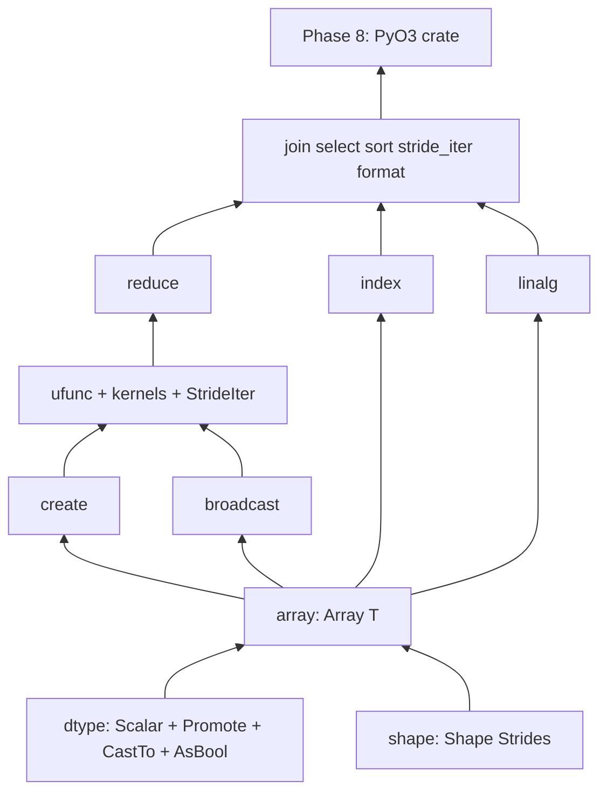

# Rust stardust-numpy (`sdnp`) 구현 플랜

교육용 Python NumPy(`../numpy`)를 Rust로 재작성한다.
단순 포팅이 아니라, 비효율·이상한 부분(리스트 버퍼, ufunc 전체 복사, mixin 등)은 재설계한다.

**장기 목표**: 코어는 Rust로 완성하고, 이후 **PyO3**로 Python 확장 모듈을 얹는다.
지금은 순수 Rust 크레이트만 유지한다 (바인딩 크레이트는 Phase 8).

## 확정된 결정

- **언어**: Rust 코어 + (나중) PyO3 Python 바인딩
- **배열 모델**: `Array<T>` (컴파일 타임 제네릭)
- **이종 연산**: 자동 승격 (`bool < i64 < f64 < Complex<f64>`)
- **제외**: `str`, object, 배열 내 혼합 dtype, 런타임 dtype API (Rust 코어).
  Python 쪽에서는 **런타임 dtype 태그 + 디스패치**로 제네릭을 감싼다.
- **기반**: from scratch (`ndarray` 크레이트에 코어 의존 안 함)
- **stride**: 원소 단위 (`isize`, 음수 뷰·broadcast 0 가능)
- **0-D**: **허용** (`shape == []`, size 1). Python 참고 구현과 다름.
- **fancy indexing**: 공식 NumPy shape에 가깝게. Rust는 **정규화된 `IndexSpec`**,
  Python은 `__getitem__`에서 객체 → `IndexSpec` 번역.
- **CoW**: 뷰는 `Arc` 공유, `set` 시 버퍼 분리 (NumPy write-through와 **의도적 차이**).
  Python↔NumPy **writable zero-copy**는 기본 제공하지 않음 (복사 또는 read-only).
- **공개 수치 API**: free function + `Result` (연산자 오버로드 없음 → Py에서 dunder로 감싸기 쉬움)

## 원소 타입

| Rust | 비고 |
|------|------|
| `bool` | |
| `i64` | 기본 정수 |
| `f64` | 기본 실수 |
| `num_complex::Complex<f64>` (`Complex64`) | |

## Rust vs Python 책임 분담 (PyO3 전제)



| 층 | 담당 |
|----|------|
| **Rust** | 버퍼·shape/strides·view/CoW·broadcast·ufunc 커널·create/reduce/linalg·fancy gather/scatter |
| **Python / PyO3** | `import sdnp`, `__add__` 등, list→array, 런타임 dtype 분기, `__repr__`, (선택) read-only buffer/DLPack |

Python `PyArray`는 내부에 `enum { Bool(Array<bool>), I64(...), F64(...), C64(...) }` 또는 동등한 태그를 두고,
메서드마다 match로 Rust free function을 호출한다.

## 코어 설계



### `Array<T>`

```rust
pub struct Array<T: Scalar> {
    data: Arc<Vec<T>>,   // 뷰 공유; set 시 CoW
    shape: Vec<usize>,
    strides: Vec<isize>, // 원소 단위
    offset: usize,
    writable: bool,      // broadcast 뷰는 false (읽기 전용)
}
```

### 승격

- `Scalar` / `Promote` / `CastTo` / `AsBool` (truthiness는 승격과 분리)
- binary op: 승격 → 동일 타입 커널
- `divide` = Rust `/` (NumPy true_divide 아님); 몫은 `trunc_divide`

### Python 참고 구현에서 의도적으로 안 옮길 것

- `list` 버퍼 → `Vec<T>` + `Arc`
- ufunc 전 전체 flat 복사 → contiguous fast-path + `StrideIter`
- mixin 이중 API → free function (+ 나중에 Py dunder)
- NumPy writable shared views → CoW

## 디렉터리

```
stardust-numpy/          # Rust 코어 (crate: sdnp)
├── Cargo.toml
├── plan.md
├── src/ ...
└── tests/

# Phase 8에서 추가 예정 (별도 패키지 또는 workspace member)
# sdnp-py/ 또는 python/  — maturin/PyO3
```

스펙 원본: `../numpy/src/numpy/`, `../numpy/tests/`.

## 구현 순서 (Phase)

| Phase | 내용 | 상태 / 완료 기준 |
|-------|------|------------------|
| **0** | `Scalar`/`Promote`/`shape`/`Array` + get/set + view + `Arc` | **완료** |
| **1** | `zeros`/`ones`/`full`/`arange`(`i64`)/`eye` + broadcasting | **완료** |
| **2** | ufunc + 승격 (산술·비교·논리, NaN/Inf); `StrideIter` | **완료** |
| **3** | 인덱싱: basic(음수·step) + **`IndexSpec` 기반** boolean/fancy gather·scatter (NumPy shape) | **완료** |
| **4** | reductions / cum\* (+ var/std/any/all) | **완료** |
| **5** | join(concatenate/stack/vstack/hstack) + select(where/nonzero/clip) + sort + spaces/meshgrid; `transpose`/`reshape`/`permute_axes`는 `array/view`에 유지 | **완료** |
| **6** | `dot`/`matmul`/trace + `tri`/`tril`/`triu`/`diag` | `test_linalg` |
| **7** | 공개 iteration API + format + integration | 나머지 |
| **8** | **PyO3 바인딩**: `PyArray`, dtype 디스패치, dunder, `Error→PyErr`, read-only buffer(선택) | `import sdnp` 스모크 + 주요 연산 |

**의존 원칙**: Phase 0–2가 뼈대. 바인딩(Phase 8)은 코어 API가 안정된 뒤.

**Phase 1에서 미룬 생성 API**:

- Phase 5: `linspace` / `logspace` / `geomspace` / `meshgrid`
- Phase 6: `tri` / `tril` / `triu` / `diag`

## PyO3를 전제로 한 코어 설계 지침 (Phase 3+)

- Fancy/boolean: `a[py_obj]` 파싱은 Python; Rust는 `IndexSpec` / `&[Array<i64>]` / `&Array<bool>` 등 **이미 정규화된 입력**만 처리.
- 에러는 계속 `sdnp::Error` enum 유지 → 바인딩에서 `impl From<Error> for PyErr`.
- 버퍼 export: `as_c_contiguous_slice()` 우선; `as_buffer()` 전체를 writable로 노출하지 않음.
- 제네릭 함수는 그대로 두고, Python은 타입별 래퍼만 추가 (Rust에 런타임 dtype enum을 **필수로 넣지 않음**).

## 테스트 전략

- Python pytest를 행동 스펙으로 사용
- Phase마다 해당 테스트만 Rust로 이식
- 의도적 차이(0-D, CoW, divide=Rust `/`, 고정폭 dtype)는 문서화
- `cargo test` = CI 기준; Phase 8 이후 추가로 `pytest` (바인딩)

## 리스크 / 나중에 한꺼번에 볼 것

- 공개 API 입력 검증 강화 (`buffer_index`의 `debug_assert` 등)
- 공유된 non-trivial view 쓰기 시 logical C-order materialize — **반영 완료**
- **TODO:** `usize` 오버플로 일관 처리
- broadcast 뷰 읽기 전용 — **반영 완료**
- **TODO(binding):** NumPy writable zero-copy와의 공존 정책 (기본 비활성)
- 승격 표에 `f32`/`i32` 추가 시 매크로 확장

## 참고: Python과의 대표 차이

| 항목 | Python `../numpy` / NumPy | Rust `sdnp` |
|------|---------------------------|-------------|
| 0-D | 참고 구현은 거부 | 허용 |
| dtype | 런타임 / str 포함 가능 | 고정폭 4종 |
| 저장 | list 또는 ndarray 공유 쓰기 | `Arc<Vec<T>>` + **CoW** |
| 이종 연산 | 런타임 승격 | `Promote` + `CastTo` |
| `/` | true divide → float | Rust `/`; 몫은 `trunc_divide` |
| 연산자 | `a + b` | `add(&a,&b)?` (Py에서 dunder로 감싸 예정) |

## 코드 리뷰 (PyO3 전제, Phase 0–3)

**지금 당장 큰 리팩터 불필요.** 바인딩에 유리한 상태다.

| 항목 | 상태 | 조치 |
|------|------|------|
| free function + `Result` | 좋음 | 유지 |
| `Error` enum (`thiserror`) | 좋음 | Phase 8에서 `PyErr` 매핑 |
| CoW + `writable` | 의도적 차이 | 문서화 유지; NumPy writable zero-copy 기본 금지 |
| `as_buffer()` 전체 노출 | 함정 가능 | `as_c_contiguous_slice()` 추가함; 바인딩은 이쪽 사용 |
| Fancy indexing | **완료** (`IndexSpec` + gather/scatter) | Phase 8에서 Py `__getitem__` 번역 |
| 런타임 dtype | 없음 | Phase 8 `PyArray` 태그로만 처리 |
| `InvalidArgument(String)` | OK | Py에서도 메시지 전달 가능 |
| `array/element` vs `index/` | 정리됨 | get/set은 `element`, gather는 `index` |
| 축/슬라이스 헬퍼 | `index/bounds` | `shape`는 레이아웃만 |
| `ufunc` 내부·미구현 phase | `pub(crate)` | 공개는 free function re-export만 |
